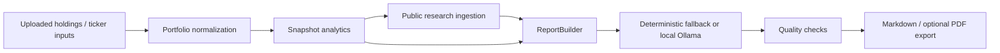

# Architecture

The project is an offline-first AI-assisted client reporting engine for wealth management teams.

## Repository Layout

```text
client_reporting/          Python analytics and reporting engine
web_app/                   Local Python-backed web workspace
tests/                     Python test suite
site/                      Interactive React/Vite public trial dashboard
docs/                      Deployment and architecture notes
```

## Reporting Pipeline



## Public Website Boundary

The `site/` app is a browser-only public trial dashboard. It supports sample data, CSV upload, editable holdings, client-side metrics, deterministic report generation, and Markdown download. It does not require the Python backend.
